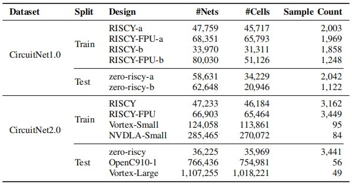

## Overview
This repository is intended to host the code and demos for IR-Hunter, aiming to help users reproduce our results through the provided implementation.
IR-Hunter is designed to improve IR-Drop prediction accuracy by innovatively leveraging techniques that have not been previously applied in this domain.


## Prerequisites
Dependencies can be installed using pip:

```bash
pip install -r requirements.txt
```

PyTorch is not listed in the requirements.txt file. You can install it by following the official instructions provided on the PyTorch website.(https://pytorch.org/)

Our experiments were conducted using Python 3.9 and PyTorch 1.11. Although other versions are likely to work, they haven't been verified.

## Datasets
The dataset includes 10,242 samples from version 1.0 and 10,336 samples from version 2.0, collected from CPUs, GPUs, and AI Chips. Detailed information is shown in the figure below:



The preprocessed dataset files are available at the following link.

## Example Usage
Before using the code, you need to modify the `IR-Hunter/utils/configs.py` file to match the file paths on your local machine.
### Train
```bash
python train.py --task Hunter --save_path work_dir/Hunter/
```
### Test
```bash
python test.py --task Hunter --pretrained PRETRAINED_WEIGHTS_PATH --save_path work_dir/Hunter/ --plot_roc
```
## Result
To better visualize the prediction results, you can use the `IR-Hunter/ReadNumpy.py` file to display your outputs.
```bash
python ReadNumpy.py
```
